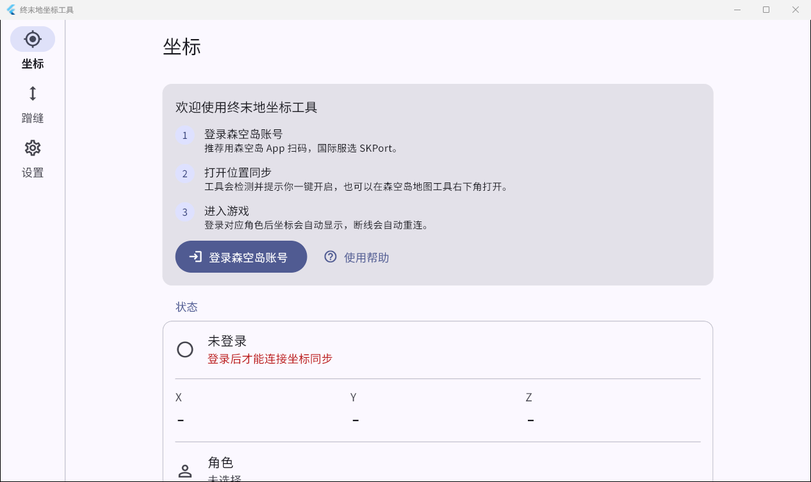

<div align="center">

# 终末地坐标工具

**实时显示《明日方舟：终末地》角色坐标，并辅助采集滑索数据的跨平台小工具**

[](https://github.com/ZipField/zipliner-client/releases/latest)
[](https://github.com/ZipField/zipliner-client/actions/workflows/ci.yml)
[](LICENSE)

Windows · Android · Linux

</div>



## 它能做什么

- **实时坐标**：登录森空岛账号后，实时显示当前角色的 X / Y / Z 坐标和所在地图。
- **置顶坐标小窗**（Windows / Linux）：一键把主界面变成置顶的小坐标窗，默认 `F12` 切换。
- **跟随游戏窗口**（Windows）：坐标窗贴在游戏窗口指定位置，背景透明、鼠标穿透，不挡操作。
- **滑索采集**：站在滑索上自动识别，或一键获取脚下滑索的坐标与朝向，复制为 Zipliner 可导入的 JSON，可选记录 CSV。
- **蹭缝估算**：填写目标高度，实时估算还要多久到达，结束后给出分段报告。
- **多账号**：可以添加多个森空岛 / SKPort 账号，在角色之间切换。


## 下载安装

到 [Releases 页面](https://github.com/ZipField/zipliner-client/releases/latest) 下载对应文件：

| 设备 | 下载 | 使用 |
| --- | --- | --- |
| **Windows 电脑** | `…-windows-x64.zip` | 右键 → 全部解压缩 → 打开文件夹 → 双击 `zipliner_client.exe` |
| **安卓手机 / 平板** | `…-android.apk` | 下载后点开安装，提示“未知来源”时选择允许 |
| Linux | `…-linux-x64.tar.gz` | 解压后运行 `zipliner_client`（需要 GTK3 与 libsecret） |

> [!TIP]
> - 一定要先**解压**再运行，不要在压缩包里直接双击。
> - Windows 提示“Windows 已保护你的电脑”：点 **更多信息** → **仍要运行**。本工具是开源软件，没有购买代码签名证书。
> - **升级**：下载新版本解压覆盖旧文件即可，账号和设置都会保留。新版本发布后，工具启动时会自动提示。

## 三步上手

1. **登录**：点“登录森空岛账号”，推荐用森空岛 App 扫码；国际服选 **SKPort**，用邮箱密码登录。
2. **打开位置同步**：工具检测到角色没有打开森空岛的“位置同步”时会提示，点 **同意并连接** 即可；
   也可以在森空岛 App → 终末地 → 地图工具的右下角手动打开。
3. **进入游戏**：登录对应角色后坐标会自动出现。断线、网络波动、角色暂时不在线时都会**自动重连**，不需要手动操作。

应用里的 **设置 → 使用帮助** 有完整的常见问题解答。

## 常见问题

<details>
<summary><b>一直显示“没有收到坐标”？</b></summary>

确认已经进入游戏，并且登录的就是“角色”一栏里的那个角色；再到森空岛 App 的地图工具确认能看到自己的位置。
有多个角色时，点“角色”切换。工具会每隔一会儿自动重试。
</details>

<details>
<summary><b>提示“登录已失效”？</b></summary>

森空岛的登录会过期，修改密码后也会失效。点状态栏里的 **重新登录**，或打开“账号管理”，在对应账号上点 **重新登录**。
</details>

<details>
<summary><b>坐标小窗怎么回到主界面？</b></summary>

按快捷键（默认 `F12`，可在“坐标显示”里修改），或点小窗右上角的按钮。
开启“跟随游戏窗口”后小窗鼠标穿透，只能用快捷键返回；如果没有找到游戏窗口，小窗会保持可点击。
如果按了快捷键没反应，可以换一个不常用的键，或尝试右键“以管理员身份运行”本工具。
</details>

<details>
<summary><b>打不开、闪退或者有其他问题？</b></summary>

打开 **设置 → 复制诊断信息**，然后到 [Issues](https://github.com/ZipField/zipliner-client/issues) 提交问题并粘贴。
诊断信息只包含版本、系统、连接状态和日志，不包含账号凭据。
</details>

## 安全与隐私

- **不经过第三方服务器**：所有请求都从你的设备直接发往鹰角 / 森空岛（`as.hypergryph.com`、`zonai.skland.com`、`ws.skland.com` 及 SKPort 对应域名）。
  唯一的其他请求是启动时向 GitHub 查询是否有新版本。
- **凭据只存本机**：账号凭据用系统加密保存（Windows DPAPI、Android Keystore、Linux 密钥环），不会写入明文文件，日志和诊断信息里也不包含凭据。
- **不碰游戏**：“跟随游戏窗口”只读取 `endfield.exe` 的窗口位置和前台状态；不读写游戏内存、不注入、不向游戏发送输入。
  全局快捷键通过定时读取按键状态实现，不安装键盘钩子。
- **开源可审计**：全部源码以 GPL-3.0 协议公开。

## 开发

需要 Flutter 3.47（Dart 3.13）。Linux 构建额外需要 `libgtk-3-dev libsecret-1-dev libjsoncpp-dev`。

```sh
flutter pub get
flutter test
flutter run -d windows
# 调试时把窗口放到副屏（逻辑像素 x,y,w,h，仅 Windows runner 读取）
ZIPLINER_WINDOW="-1880,300,1280,760" flutter run -d windows
```

```
lib/
  main.dart / app.dart   入口、单实例、错误兜底、设置页的“帮助与关于”
  skland/                森空岛本机请求：签名、登录、角色、滑索标记、定位 WebSocket
  position/              连接监控（自动重连）、错误解释、账号存储、滑索识别/导出、采集记录、蹭缝估算
  desktop/               坐标小窗、全局快捷键、游戏窗口定位、单实例（Win32）
  pages/                 坐标、蹭缝、登录、账号管理、使用帮助
  core/                  版本信息、日志与诊断、更新检查；以及 Zipliner 后端客户端（坐标功能不使用）
  ui/                    主题与排版修正
```

实现要点：

- **签名**：`md5(hex(hmacSha256(token, path + query/body + timestamp + headerJson)))`，时间戳比当前早 3 秒，并用 zonai 的 `Date` 头校正本机时钟。
- **全局快捷键**：`hotkey_manager` 在 Windows 上注册热键会让进程退出，改为每 40ms 调用 `GetAsyncKeyState` 读取按键状态（含“按下过”位，能捕捉快速点按）。
- **不调用 `windowManager.setSkipTaskbar`**：在 Windows 上会让进程卡死。
- **多显示器缩放**：window_manager 用 Dart 端的 devicePixelRatio 换算坐标，混合缩放时不可靠，Windows 上直接用 Win32 物理坐标保存 / 恢复窗口和摆放坐标窗。
- **MD3 布局**：宽屏侧栏布局下标题由内容区渲染（避免顶部栏压在侧栏上方）；`TfSection` 中的非列表项用 `SectionBody` 补边距；Windows 显式使用微软雅黑。

## 发布

推送 `vX.Y.Z` 标签即可，[Release 工作流](.github/workflows/release.yml) 会先跑测试，再构建 Windows / Linux / Android 并创建 Release：

```sh
git tag v0.2.0
git push origin v0.2.0
```

- Windows 包附带 VC++ 运行库 DLL 与中文使用说明。
- Android 使用固定签名（仓库 Secrets：`ANDROID_KEYSTORE_BASE64`、`ANDROID_KEYSTORE_PASSWORD`、`ANDROID_KEY_ALIAS`、`ANDROID_KEY_PASSWORD`），
  保证新版本可以直接覆盖安装。**签名文件丢失后将无法再发布可覆盖升级的 APK，请妥善备份。**
- 版本号来自标签：`--build-name` 取标签数字部分，`--build-number` 取工作流运行序号，`APP_VERSION` 用于应用内显示和更新检查。

## 致谢

- 功能移植自 [ZipField/endfield-player-position-display](https://github.com/ZipField/endfield-player-position-display)。
- 界面基于 [tf_framework](https://pub.dev/packages/tf_framework)。
- 森空岛接口的调用方式参考 Zipliner 服务端实现。

本项目与鹰角网络（Hypergryph / Gryphline）无关，“明日方舟：终末地”“森空岛”等为其商标。

## 许可证

[GPL-3.0-or-later](LICENSE) © ZipField 与贡献者
